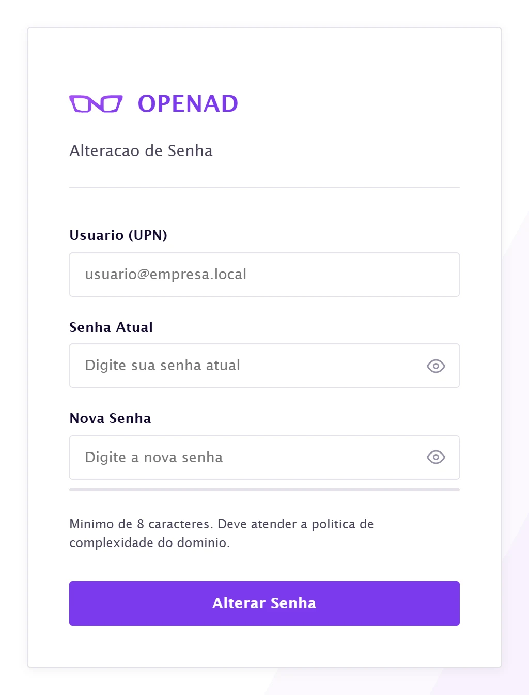
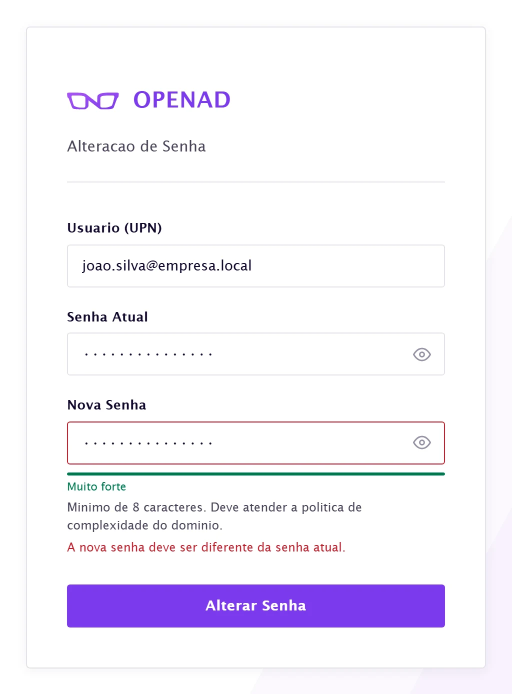
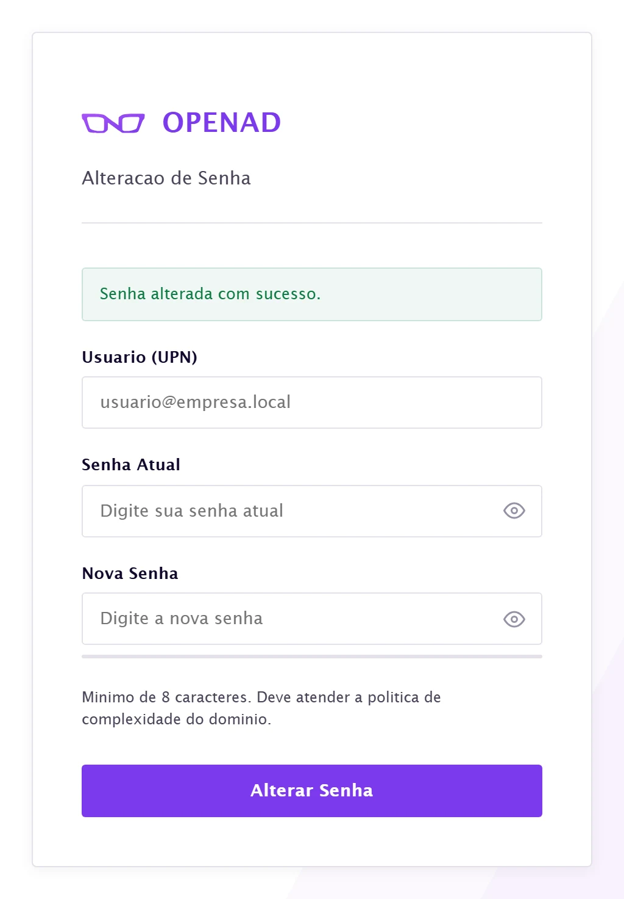

<div align="center">


A three-field form that changes a person's password in Active Directory. No
session, no database, no password stored anywhere.

[](LICENSE.md)   

[The screen](#the-screen) · [How it works](#how-it-works) · [Run it](#run-it) · [Configure](#configure) · [Security](#security) · [License](#license)

</div>

---

## What it is

"I forgot my password" is the most common ticket any service desk gets, and the
most expensive relative to what it solves: someone in IT stops what they're
doing, confirms the identity of whoever called and types the new password into
ADUC.

OpenAD takes IT out of the middle. The person opens the page, proves who they
are with their current password and picks a new one. Active Directory remains
the authority: complexity, history and minimum age are validated by the domain
GPO, not by this code.

<div align="center">

</div>

---

## The screen

<table>
<tr>
<td width="50%"><br><sub><b>Rejected</b> · the reason shows up in the field, not in a generic alert</sub></td>
<td width="50%"><br><sub><b>Success</b> · no redirect, no session to close</sub></td>
</tr>
</table>

> These aren't mockups: it's the application running, with real backend
> validation responding. Password strength is measured in the browser only to
> give immediate feedback — what decides whether a password is valid is AD.

---

## How it works

The change happens in three steps, and none of them stores the password.

```
[1] validate input          UPN, length, LDAP injection characters
         │
[2] rate limit per IP       5 attempts / 5 min, sliding window
         │
[3] resolve the DN          service account, read only
         │
[4] bind with current pwd   ← proof of identity happens here
         │
[5] modify unicodePwd       AD applies history, complexity and GPO
         │
[6] audit log               ip, upn, result. Never the password.
```

### Three decisions worth recording

**Proof of identity is a bind, not a comparison.** Step 4 opens an LDAP
connection with the UPN and the current password the person typed. If the bind
fails, the password is wrong — and it's the domain saying so, with its own
error code (`52e` wrong password, `775` account locked out, `533` account
disabled). OpenAD has no user table to query, because it has no database.

**The service account is what writes, and that's deliberate.** The more obvious
path would be for the person themselves to run `unicodePwd` with a `DELETE` of
the old password and an `ADD` of the new one. It works, but it runs into
**minimum password age**: if the GPO requires a password to be at least a day
old, the change is refused for exactly the people who just got a temporary
password from support — the most common case. So after the person proves who
they are in step 4, the `MODIFY_REPLACE` is done by the service account, which
has `Reset Password` delegated. Minimum age doesn't apply to an administrative
reset; history and complexity still do.

The price of that decision is an account with the power to reset passwords in
the OU. It's the most sensitive credential in the installation, and the
[security](#security) section covers it.

**`/health` does a real bind on every call.** A healthcheck that only answers
"the process is up" lies: the container stays green while nobody can change any
password because the DC is down. Here the endpoint authenticates the service
account and returns `503` when the directory doesn't respond. It costs one bind
per call, and it's what makes monitoring honest.

---

## Run it

You need **Docker** and network access to port 389 (or 636) on the Domain
Controller.

```bash
cp .env.example .env     # fill in the server, the domain and the service account
docker compose up -d --build
```

The application comes up at `http://localhost:8000`. To follow along:

```bash
docker compose logs -f openad
docker inspect openad --format='{{.State.Health.Status}}'   # healthy | unhealthy
```

### Without Docker, for development

```bash
pip install -r requirements.txt
uvicorn app.main:app --reload
```

### Check the AD integration

```bash
curl -s http://localhost:8000/health
```

```json
{ "status": "ok", "ldap": "LDAP connection successful." }
```

`503` with `"status": "degraded"` means the service account bind failed — wrong
credential, unreachable DC or blocked port. The log says which:

```
level=ERROR logger=openad ldap.probe status=failed server=dc01 port=389 error=LDAPSocketOpenError
```

---

## Configure

Everything comes from environment variables. No sensitive value has a default
in the code, and `.env` doesn't go into Git.

| Variable | Required | What it is |
|---|---|---|
| `LDAP_SERVER` | yes | Domain Controller hostname or IP |
| `LDAP_PORT` | — | `389` (default) or `636` for LDAPS |
| `LDAP_DOMAIN` | yes | AD domain, e.g. `empresa.local` |
| `LDAP_BASE_DN` | yes | Search base, e.g. `dc=empresa,dc=local` |
| `LDAP_USE_TLS` | — | `true` turns on StartTLS over 389 |
| `CA_CERT_PATH` | conditional | Internal CA certificate inside the container |
| `LDAP_BIND_USER` | yes | Service account UPN |
| `LDAP_BIND_PASSWORD` | yes | Its password |
| `RATE_LIMIT_MAX` | — | Attempts per IP per window. Default `5` |
| `RATE_LIMIT_WINDOW` | — | Window in seconds. Default `300` |
| `LOG_LEVEL` | — | `INFO` (default), `DEBUG`, `WARNING`, `ERROR` |

### The brand is yours

The portal wears the face of whoever operates it, not of whoever wrote the
code. These variables repaint the screen without editing HTML or rebuilding the
image — the frontend reads `GET /api/branding` on load and applies it:

| Variable | Default |
|---|---|
| `BRAND_NAME` | `OpenAD` |
| `BRAND_LOGO_URL` | `/static/brand-mark.svg` |
| `BRAND_COLOR` | `#7C3AED` |
| `BRAND_COLOR_ACCENT` | `#A855F7` |
| `BRAND_FOOTER` | empty, falls back to `BRAND_NAME` |
| `BRAND_UPN_EXAMPLE` | `usuario@empresa.local` |

To use your own logo, mount the file into `/app/app/static/` and point
`BRAND_LOGO_URL` at it. An external URL works too.

`BRAND_UPN_EXAMPLE` deserves attention: it's the placeholder in the username
field. Leaving it at the default makes people guess the format your domain
expects.

---

## Under the hood

```
app/
  main.py           routes, lifecycle, audit log
  ldap_service.py   the rule: resolve DN, authenticate, change the password
  ldap_client.py    connection factory: plain, StartTLS, probe
  validators.py     UPN, password length, LDAP anti-injection
  rate_limiter.py   sliding window per IP, thread-safe
  config.py         all environment config enters here
  static/           the page, the logo and the favicon
```

The split between `ldap_client` and `ldap_service` is what makes it possible to
move from plain LDAP to StartTLS by touching only an environment variable: the
service doesn't know how the connection was built.

### Architecture choices

| Decision | Why |
|---|---|
| **No database** | There's no session, no registration and no history to store. AD is the state. |
| **No frontend framework** | One page, three fields. Plain HTML and JS deliver that in 21 KB, with no build step. |
| **In-memory rate limit** | One instance, one process. Restarting resets the counters — acceptable against brute force, which is measured in minutes. Multiple replicas would require Redis. |
| **Swagger docs disabled** | `docs_url=None`. The API has two endpoints and an audience that doesn't call them by hand. |
| **One worker, 150 MB** | The work is network I/O. More workers would only multiply idle connections to the DC. |

---

## Security

**The password is never written down.** It doesn't go into logs, it doesn't go
to disk, it doesn't sit in a session. It exists in the process for the duration
of the bind and the modify.

**The service account is the most sensitive credential here.** It needs read
access to the directory and `Reset Password` delegated on the users OU — and
nothing else. Don't give it Domain Admin. Delegate at minimum scope, keep the
password in a vault and rotate it:

```bash
# after changing its password in AD
docker compose up -d --force-recreate
curl -s http://localhost:8000/health
```

**Turn TLS on.** Over plain LDAP, the step 4 bind sends the person's password
in the clear. On an isolated VLAN reaching only the DC that's a contained risk;
on any routed network, it isn't:

```env
LDAP_USE_TLS=true
CA_CERT_PATH=/certs/ca.crt   # if the DC uses an internal CA
```

```yaml
# docker-compose.yml
volumes:
  - /opt/openad/certs:/certs:ro
```

Without `CA_CERT_PATH`, TLS comes up without validating the peer — it encrypts
the traffic, but doesn't protect against a man in the middle. Good enough for a
lab, not for production.

**Don't expose port 8000 to the internet.** This is an internal portal. Put a
reverse proxy with TLS in front and, if the domain is fixed, restrict
`allow_origins` in `main.py`, currently `*`.

**`LOG_LEVEL=DEBUG` says too much.** It reveals the directory structure in the
logs. Use it to diagnose, then turn it off.

### What the logs record

`key=value` format, with nothing sensitive:

```
level=INFO logger=openad change_password_attempt ip=198.51.100.24 upn=joao@empresa.local ts=2026-03-30T10:24:05+00:00
level=INFO logger=openad ldap.auth status=ok upn=joao@empresa.local
level=INFO logger=openad ldap.change_password status=success upn=joao@empresa.local
```

| In the logs | What happened |
|---|---|
| `ldap.auth status=bind_failed` + `data 52e` | Current password incorrect |
| `ldap.auth status=bind_failed` + `data 775` | Account locked out |
| `ldap.lookup status=not_found` | The UPN doesn't exist in the directory |
| `status=failed ... constraint violation` | The new password hit the GPO |
| `insufficientAccessRights` | `Reset Password` not delegated to the service account |
| `rate_limit_exceeded` | Same IP, more than 5 attempts in 5 minutes |
| `config_missing field=...` | Required variable missing from `.env` |

---

## Known limitations

- **The rate limit doesn't survive a restart** and isn't shared between
  replicas. One instance behind a proxy is the supported design.
- **`X-Forwarded-For` is read without a trusted proxy list.** Behind a reverse
  proxy that rewrites the header, that's correct; exposed directly, the rate
  limit IP can be forged. One more reason not to publish port 8000.
- **There's no forgotten-password recovery.** Changing requires knowing the
  current password. Whoever doesn't know it still needs the service desk —
  OpenAD solves the volume, not the edge case.
- **No MFA.** Proof of identity is the current password, and that's it.
- **The interface is in Portuguese**, with the AD error messages translated by
  hand.

---

## License

**© 2026 NerdResolve. All rights reserved.** See [LICENSE.md](LICENSE.md).

The repository is public for technical evaluation and portfolio demonstration.
The code may be read and studied; there is no license to use, copy or
redistribute it.

---

<div align="center">


**OpenAD**, built by [NerdResolve](https://nerdresolve.com)

Want a portal like this in your infrastructure? **contact@nerdresolve.com**

</div>
